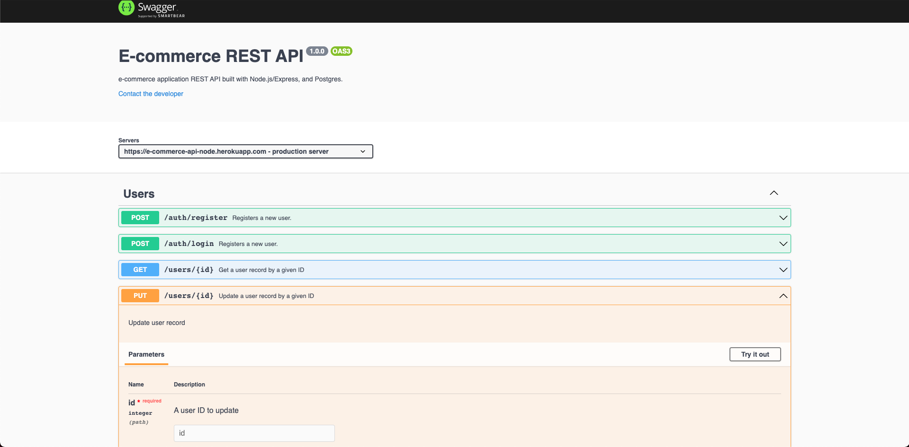

# codecademy-ecommerce-rest-api

Node/Express REST API to provide typical functionality found in an ecommerce website. Users can create accounts, view products, add products to a cart, and place/view orders.

[Documentation](https://e-commerce-api-node.herokuapp.com/docs/#/Users/put_users__id_)

## Running the app

To run locally, `npm install`, then `npm run start`

This project requires a [PostgreSQL](https://www.postgresql.org/) database to be running locally. Reference the ERD diagram located in the `resources` folder of this repo to view the structure of the tables. You can use [pgAdmin](https://www.pgadmin.org/) to interact with the database manually.

This repo includes an `example.env` file that contains important environment variables for reference. Make sure to create a `.env` file and include all variables found in the `example.env` file, replacing the example values with those specific to your environment/needs.

To easily populate your database with the requisite tables, `npm run create-db`. This will create tables in your database if they do not already exist. The configuration for this script can be found in the `setupDatabase.js` file located in the root of this project.

Once the app is running locally, you can access the API at `http://localhost:<your-port>`

## Testing

Swagger documentation available at `http://localhost:<your-port>/docs`

You can use various HTTP clients such as [Postman](https://www.postman.com/) or [Insomnia](https://insomnia.rest/) to make requests to the API endpoints.

**Note:** Some endpoints are protected and require authentication. In order to properly access these endpoints, you will need to have a session cookie present when making your request. This is accessed by hitting the `/auth/login` endpoint first. HTTP clients will automatically store cookies and send them with subsequent requests.

## Resources

- [REST Architecture](https://www.codecademy.com/articles/what-is-rest)
- [Setting up Postman](https://learning.postman.com/docs/getting-started/settings/)
- [Using pgAdmin](https://www.pgadmin.org/docs/pgadmin4/development/getting_started.html)
- [Postgres Cheat Sheet](https://www.postgresqltutorial.com/postgresql-cheat-sheet/)
- [Documenting your API with Swagger](https://swagger.io/resources/articles/documenting-apis-with-swagger/)

## Options for Extension

- Add additional API endpoints (endpoints for categories, addresses, etc)
- Add ability to maintain multiple carts per user
- Add ability to interact with the API as a guest
